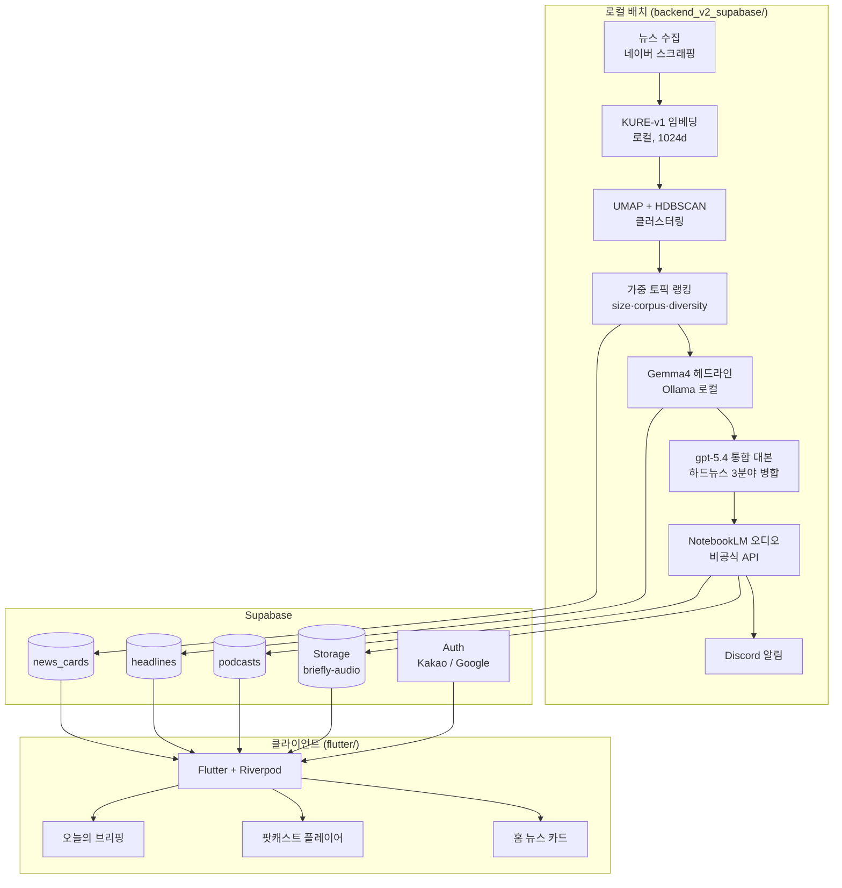

# Briefly — AI 뉴스 팟캐스트 플랫폼

**한국어 뉴스를 AI가 큐레이션하고, 대화형 팟캐스트로 만들어 하루 두 번(오전/오후) 전달하는 개인 프로젝트.**

[](https://www.python.org/)
[](https://flutter.dev/)
[](https://supabase.com/)
[](https://openai.com/)
[](https://notebooklm.google.com/)
[](https://ollama.com/)

---

## 개요

매일 뉴스를 수집해 AI 큐레이션을 거쳐 팟캐스트 오디오로 만드는 엔드투엔드 자동화 파이프라인.
**배치 처리(로컬)** + **Supabase** + **모바일 앱(Flutter)** 의 2계층 구조로, 별도 API 서버가 없습니다.

### 특징

- **자동 파이프라인** — 뉴스 수집부터 오디오 배포까지 무인 운영, 하루 2회
- **통합 브리핑** — 카테고리별 팟캐스트가 아니라, 하드뉴스 3분야(정치·경제·국제)를 하나로 엮은 8~10분 브리핑
- **가중 토픽 랭킹** — size / corpus coverage / press diversity 3축 평가로 그날의 주요 이슈 선별
- **로컬 임베딩 + 로컬 LLM** — KURE-v1(임베딩)과 Gemma4(헤드라인)로 해당 단계 비용 $0
- **정통 뉴스 방송 톤** — gpt-5.4가 생성한 앵커/해설 2인 대본을 NotebookLM이 오디오로 변환
- **직접 연동** — Flutter 앱이 Supabase를 직접 조회. API 서버 계층 없음
- **Discord 실시간 모니터링** — 파이프라인 단계별 알림을 2채널(alerts / pipeline)로 분리

---

## 아키텍처


```mermaid
graph TB
    subgraph "로컬 배치 (backend_v2_supabase/)"
        direction TB
        N1[뉴스 수집<br/>네이버 스크래핑]
        N2[KURE-v1 임베딩<br/>로컬, 1024d]
        N3[UMAP + HDBSCAN<br/>클러스터링]
        N4[가중 토픽 랭킹<br/>size·corpus·diversity]
        N5[Gemma4 헤드라인<br/>Ollama 로컬]
        N6[gpt-5.4 통합 대본<br/>하드뉴스 3분야 병합]
        N7[NotebookLM 오디오<br/>비공식 API]
        N9[Discord 알림]
    end

    subgraph "Supabase"
        D1[(news_cards)]
        D2[(headlines)]
        D3[(podcasts)]
        S1[(Storage<br/>briefly-audio)]
        AU[Auth<br/>Kakao / Google]
    end

    subgraph "클라이언트 (flutter/)"
        M1[Flutter + Riverpod]
        M2[오늘의 브리핑]
        M3[팟캐스트 플레이어]
        M4[홈 뉴스 카드]
    end

    N1 --> N2 --> N3 --> N4 --> N5 --> N6 --> N7 --> N9
    N4 --> D1
    N5 --> D2
    N7 --> D3
    N7 --> S1

    D1 --> M1
    D2 --> M1
    D3 --> M1
    S1 --> M1
    AU --> M1
    M1 --> M2
    M1 --> M3
    M1 --> M4
```

---

## 파이프라인

`app/tasks/scheduler.py` 가 오케스트레이터이며 **2 Phase** 로 나뉩니다.

### Feed Phase — 6개 카테고리 전부

| # | 단계 | 구현 | 비고 |
|---|---|---|---|
| 1 | **뉴스 수집** | `naver_news_service.py` | 카테고리 병렬 prefetch (max_workers=6) |
| 2 | **임베딩** | `embedding_service.py` | KURE-v1 (한국어 특화, 1024d). 완료 후 모델 언로드 |
| 3 | **Near-duplicate 제거** | `clustering_service.py` | cosine similarity 0.95 임계값 |
| 4 | **UMAP + HDBSCAN 클러스터링** | `clustering_service.py` | 동적 mcs, 거대 클러스터 fallback |
| 5 | **가중 토픽 랭킹** | `clustering_service.py` | `0.25·size + 0.60·corpus + 0.15·diversity` |
| 5-b | **`news_cards` 저장** | `supabase_storage_service.py` | 클러스터 대표기사 rank 1~20 |
| 6 | **오늘의 브리핑 헤드라인** | `headline_service.py` | Ollama Gemma4 로컬 → `headlines`, top 5 |
| 7 | **비례 배분 소스 풀** | `clustering_service.py` | 하드뉴스 한정. 토픽당 최소 6건, 총 50건 |

### Briefing Phase — 슬롯당 1회

**정치·경제·국제** 3개 카테고리의 top 4 토픽(총 12개)을 하나로 엮어 단일 대본을 만듭니다.
사회·문화·IT/과학은 Feed 단계만 수행하고 팟캐스트에는 포함되지 않습니다.

| # | 단계 | 구현 | 비고 |
|---|---|---|---|
| 8 | **gpt-5.4 통합 대본** | `script_service.py` | Closed-World + Source-Tagged, 목표 7,500자 |
| 9 | **NotebookLM 오디오** | `notebooklm_service.py` | ~15분 소요, 8~10분 분량 |
| 10 | **Supabase 저장** | `supabase_storage_service.py` | Storage 업로드 + `podcasts` 1행 |

### 품질 검증
- **Closed-World 프롬프트** — 소스 기사에 없는 내용은 금지
- **Source-Tagged 대본** — `[S1]...[SN]` 태그로 모든 사실 주장을 추적
- **규칙 기반 숫자 검증** — 대본의 수치를 원본 기사에서 직접 대조
- **후처리** — 연속 화자 병합, 메타언어 탐지, 숫자 과밀 경고
- **중복 토픽 제거** — 최근 24시간 팟캐스트의 `covered_keywords` 와 2개 이상 겹치면 제외

---

## 데이터 모델

### Supabase (Postgres)

**`podcasts`** — 통합 브리핑 대본 + 오디오
- UNIQUE (`date`, `slot`) — 하루 최대 2행
- Fields: `script`, `audio_url`, `title`, `covered_keywords`, `duration_sec`

**`headlines`** — 오늘의 브리핑 카드 (AI 큐레이션)
- UNIQUE (`category`, `date`, `slot`)
- Fields: `headlines` (JSON: topic_id, headline, summary, cluster_size, representative_title/image/press, keywords)

**`news_cards`** — 홈 탭 기사 카드 (클러스터 대표기사)
- PK: `news_id` (oid+aid 기반), rank 1~N upsert
- Fields: `title`, `images`, `provider`, `rank`, `cluster_size`, `content`, `published_at`

### Storage

버킷 `briefly-audio` (public):

```
briefly-audio/
└── {date}/
    ├── briefing_AM.mp3
    └── briefing_PM.mp3
```

카테고리별 파일이 아니라 **슬롯당 1개**입니다.

### Auth

Supabase Auth 사용. Kakao(OAuth web flow) + Google(네이티브 Sign-In → `signInWithIdToken`).

---

## 기술 스택

### 배치 파이프라인 (`backend_v2_supabase/`)
- **Python 3.12**, CLI 스케줄러 (웹 프레임워크 없음)
- **수집**: `httpx` + `BeautifulSoup` (네이버 스크래핑)
- **임베딩**: `sentence-transformers` + KURE-v1 (로컬)
- **클러스터링**: `umap-learn` + `hdbscan` + `scikit-learn`
- **형태소 분석**: `konlpy` (Okt) — **선택적**, 없으면 정규식 토크나이저로 폴백
- **LLM**:
  - 대본 — OpenAI `gpt-5.4` (`engines/` 로 추상화)
  - 헤드라인 — Ollama `gemma4:e4b-it-q4_K_M` (로컬)
- **오디오**: `notebooklm-py` (비공식 API, 쿠키 기반 자동 인증) + `playwright`
- **저장**: `supabase` (Postgres + Storage)
- **알림**: Discord 웹훅 2채널

### 모바일 앱 (`flutter/`)
- **Flutter** + **Riverpod** (상태 관리)
- **라우팅**: `go_router`
- **오디오**: `just_audio` + `just_audio_background` (백그라운드 재생)
- **백엔드**: `supabase_flutter` — DB 직접 조회, 중간 API 없음
- **인증**: `google_sign_in` + Supabase OAuth (Kakao), `app_links` (딥링크 콜백)
- **화면**: 오늘의 브리핑 / 홈 / 팟캐스트 / 에피소드 / 검색 / 북마크 / 프로필 / 설정

### 외부 서비스
| 서비스 | 용도 | 비용 |
|---|---|---|
| OpenAI gpt-5.4 | 통합 대본 생성 (2회/일) | 사용량 과금 |
| NotebookLM | 오디오 생성 | 무료 (비공식 API) |
| 네이버 뉴스 | 뉴스 수집 | 무료 (스크래핑) |
| KURE-v1 | 임베딩 | 무료 (로컬) |
| Gemma4 | 헤드라인 | 무료 (로컬) |
| Supabase | DB + Storage + Auth | Free Tier 내 |
| Discord | 알림 | 무료 |

---

## 프로젝트 구조

```
Briefly/
├── backend_v2_supabase/          # ★ 현재 백엔드 — 배치 파이프라인
│   ├── app/
│   │   ├── services/
│   │   │   ├── naver_news_service.py       # 1. 수집
│   │   │   ├── embedding_service.py        # 2. 임베딩 + unload
│   │   │   ├── clustering_service.py       # 3~5,7. 클러스터링·랭킹·소스풀
│   │   │   ├── headline_service.py         # 6. Gemma4 헤드라인
│   │   │   ├── script_service.py           # 8. gpt-5.4 통합 대본
│   │   │   ├── script_postprocess.py       #    대본 후처리
│   │   │   ├── notebooklm_service.py       # 9. 오디오
│   │   │   ├── supabase_storage_service.py # 10. Storage + Postgres
│   │   │   ├── notify_service.py           #    Discord 알림
│   │   │   ├── eval_service.py             #    대본 품질 평가
│   │   │   ├── podcast_eval_service.py     #    오디오 품질 평가
│   │   │   └── engines/                    #    LLM 엔진 추상화
│   │   ├── tasks/scheduler.py              # 메인 오케스트레이터
│   │   ├── constants/category_map.py       # 6개 카테고리
│   │   └── utils/                          # date(KST/슬롯), supabase_client
│   ├── test/                     # 실행형 검증 스크립트
│   └── requirements.txt
│
├── flutter/                      # ★ 현재 클라이언트 — 모바일 앱
│   ├── lib/
│   │   ├── core/                 # config(Supabase) / router / theme / constants
│   │   ├── features/
│   │   │   ├── today/            # 오늘의 브리핑 (AM/PM)
│   │   │   ├── home/             # 카테고리별 뉴스 카드
│   │   │   ├── frequency/        # 팟캐스트 플레이어 + 에피소드 목록
│   │   │   ├── headlines/        # 헤드라인 카드
│   │   │   ├── news_detail/      # 기사 상세
│   │   │   ├── search/           # 검색
│   │   │   ├── bookmarks/        # 북마크
│   │   │   ├── auth/             # Kakao / Google 로그인
│   │   │   ├── profile/          # 프로필
│   │   │   ├── settings/         # 폰트 설정
│   │   │   ├── onboarding/       # 온보딩
│   │   │   ├── shell/            # 하단 탭 셸
│   │   │   └── splash/
│   │   └── shared/
│   └── pubspec.yaml
│
├── CLAUDE.md                     # Claude Code 작업 가이드
└── README.md
```

### 히스토리 (보존용, 현재 미사용)

포트폴리오 목적으로 이전 버전을 남겨두었습니다. **현재 동작의 근거로 삼지 마세요.**

| 경로 | 무엇이었나 |
|---|---|
| `backend/` | v1 — FastAPI + AWS Lambda + DynamoDB + BigKinds + ElevenLabs |
| `backend_v2/` | v2 초기 — 파이프라인은 현재와 유사하나 저장이 DynamoDB/S3 |
| `frontend/` | v1 웹 (Next.js 14) |
| `mobile/` | React Native + Expo 앱 |
| `mobile_v2_expo/` | Expo 재작성 시도 |
| `Briefly_design/` | 디자인 산출물 |

---

## 시작하기

### 요구사항
- **Python 3.12**, **Flutter SDK**
- **CUDA GPU** (KURE-v1 로컬 추론용 — 없으면 CPU 폴백, 매우 느림)
- **Ollama** (`gemma4:e4b-it-q4_K_M` pull 필요)
- **Supabase 프로젝트** (Postgres + Storage + Auth)
- **OpenAI API 키**
- **NotebookLM 구글 계정 쿠키** (`notebooklm login`)
- **Discord 웹훅 URL** 2개 (alerts / pipeline)
- JDK 17 — `konlpy` 를 쓸 때만. 없으면 정규식 폴백으로 동작

### 배치 파이프라인 실행

```bash
cd backend_v2_supabase
pip install -r requirements.txt

# 전체 실행 (현재 KST 시각으로 오전/오후 자동 판정)
python -m app.tasks.scheduler

# 슬롯 명시
python -m app.tasks.scheduler --time-slot morning
python -m app.tasks.scheduler --time-slot afternoon

# 특정 카테고리만 (Feed 단계 한정)
python -m app.tasks.scheduler --categories economy politics

# 오디오 건너뛰기 (대본까지만)
python -m app.tasks.scheduler --skip-podcast

# Feed 단계만 (대본·오디오 통째로 생략)
python -m app.tasks.scheduler --skip-script
```

Windows 콘솔(cp949)에서는 이모지 로그가 깨지므로:

```bash
$env:PYTHONIOENCODING='utf-8'; python -m app.tasks.scheduler
```

### cron 등록 (Ubuntu)

```bash
0 5  * * * cd ~/Briefly/backend_v2_supabase && /usr/bin/python3 -m app.tasks.scheduler --time-slot morning   >> /var/log/briefly.log 2>&1
0 16 * * * cd ~/Briefly/backend_v2_supabase && /usr/bin/python3 -m app.tasks.scheduler --time-slot afternoon >> /var/log/briefly.log 2>&1
```

### 모바일 앱

```bash
cd flutter
flutter pub get
flutter run
flutter build apk --release
```

### 환경 변수 (`backend_v2_supabase/.env`)

```bash
# OpenAI
OPENAI_API_KEY=sk-proj-...
OPENAI_MODEL=gpt-5.4
OPENAI_JUDGE_MODEL=gpt-5.4

# Supabase
SUPABASE_URL=https://<project-ref>.supabase.co
SUPABASE_SERVICE_ROLE_KEY=...
SUPABASE_AUDIO_BUCKET=briefly-audio

# Discord 알림
DISCORD_WEBHOOK_URL=https://discord.com/api/webhooks/.../...         # alerts 채널
DISCORD_PIPELINE_WEBHOOK_URL=https://discord.com/api/webhooks/.../... # pipeline 채널
```

Flutter 쪽 Supabase 설정은 `flutter/lib/core/config/` 에 있습니다.

---

## 현재 상태 (2026-07-29 기준)

### ✅ 완료
- 6개 카테고리(정치/경제/사회/문화/국제/IT과학) Feed 파이프라인
- 하드뉴스 3분야 통합 브리핑 대본 + NotebookLM 오디오
- Supabase 마이그레이션 (Postgres 3테이블 + Storage + Auth)
- Flutter 앱 Supabase 직접 연동
- Kakao / Google 로그인
- 오늘의 브리핑 자동 생성 (Gemma4 로컬, 비용 $0)
- Discord 실시간 모니터링 (2채널)

### 🚧 진행 중
- 수집 시간 윈도우 활성화 (`BRIEFING_WINDOW_ENABLED`, 출시 전까지 비활성)
- 정기 실행 자동화 등록 (cron)
- UI 재설계

### 💡 개선 여지
- 토픽 랭킹 가중치 튜닝
- 오디오 TTS 한국어 숫자 처리 (현재는 전처리로 완화)
- 임베딩 캐시 키에 모델명 포함 (현재 모델 교체 시 수동으로 캐시를 비워야 함)

---

## 라이선스

MIT License.
